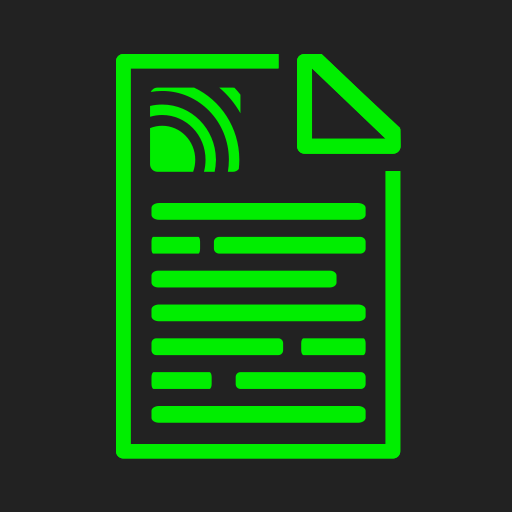

    

    <h1>MQTT Monitoring Tool</h1>
    A flask server which listens to mqtt topics and displays them on a webpage.

---

## Use

1. `docker pull ghcr.io/tim0-12432/mqtt-listener:latest`
2. `docker run --name mqtt-listener -d -p 8082:8080 --env MQTT_LISTEN-MQTT-HOST=192.168.0.2 ghcr.io/tim0-12432/mqtt-listener:latest`

If you want to enable Tasmota discovery, you need to add the following environment variables:
`MQTT_LISTEN-TASMOTA_ENABLED=True`

## Custom

### Build own image

`sudo docker build . --file Dockerfile --tag tim0-12432/mqtt-listener:<tag>`

### Run own container

`sudo docker run --name mqtt-listener -d -p 8082:8080 --env MQTT_LISTEN-MQTT-HOST=192.168.0.2 tim0-12432/mqtt-listener:<tag>`

For debugging purposes you can set following environment variables:
`MQTT_LISTEN-LOG_LEVEL=DEBUG` and `MQTT_LISTEN-APP-DEBUG=True`

## Images

    
&nbsp;&nbsp;
    

